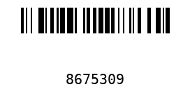

# ReadMe

Basic python-based code128 barcode generator, creates a png image file with the barcode in the working directory, can be used in scripts.
An exe compiled using cxfreeze is available.

## Command line arguments

| Argument      | Meaning                               |
| ------------- | ------------------------------------- |
| --content     | barcode content (ascii)               |
| --output      | output filename (ascii)               |
| --height      | height of barcode (int)               |
| --textvisible | write text under barcode (true/false) |
| --help        | show help                             |

Example: `python .\python-barcode-generator.py --content 8675309 --output testbarcode --height 3 --textvisible true`

Result:

## How to build standalone exe

1. create venv for project `python -m venv python-barcode-generator-venv`
2. activate venv (powershell) `./python-barcode-generator-venv/Scripts/Activate.ps1`
3. install dependencies:
   - `pip install "python-barcode[images]"`
   - `pip install --upgrade cx_Freeze`
4. `python cxfreeze.py build`
